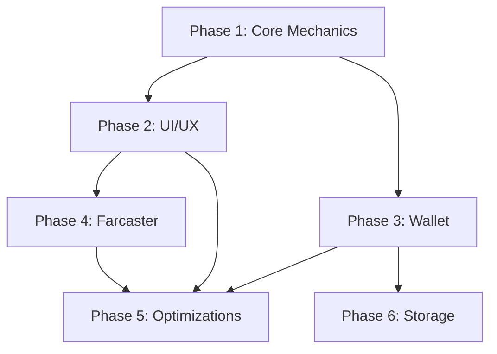

```markdown
# CyberSnake Frame v2 Development Plan

## Phase 1: Core Game Mechanics Implementation (Dependencies: None)

### Objectives
- Implement basic snake movement mechanics
- Establish game loop architecture
- Create touch input foundation

### Components
1. Canvas rendering system (2D context)
2. Game state machine (useReducer)
3. Touch event normalization layer
4. Collision detection system
5. Food spawning logic

### Challenges
- Preventing 180° direction reversal conflicts
- Touch vs gesture event interference
- Frame pacing consistency across devices

### Mobile Considerations
- Implement 5px touch deadzone threshold
- Prevent default touch actions (`touch-action: none`)
- Landscape orientation canvas scaling

---

## Phase 2: Retro UI/UX Implementation (Dependencies: Phase 1)

### Objectives
- Create CRT visual effects
- Implement responsive score display
- Build game state overlays

### Components
1. CSS scanline animation system
2. Retro header with dynamic scaling
3. Win/Lose modal system
4. Touch feedback ripple effect
5. Orientation change handlers

### Challenges
- Maintaining pixel-perfect rendering across DPIs
- Overlay z-index management
- CSS animation performance optimization

### Mobile Considerations
- Media queries for portrait/landscape layouts
- Touch target sizing (>48px)
- Viewport meta tag configuration

---

## Phase 3: Wallet Integration Layer (Dependencies: Phase 1)

### Objectives
- Connect wallet identity system
- Implement score signing
- Gasless transaction flow

### Components
1. Wagmi connection manager
2. Message signing interface
3. Wallet state listener
4. Signature validation stub

### Challenges
- Mobile wallet app interoperability
- Session persistence management
- Error handling for rejected signatures

### Mobile Considerations
- Deep linking for wallet apps
- Mobile browser wallet detection
- Touch-friendly connection modal

---

## Phase 4: Farcaster Frame Compliance (Dependencies: Phase 2)

### Objectives
- Implement frame metadata
- Configure frame post endpoints
- Validate frame interactions

### Components
1. Frame metadata tags
2. Post message handler
3. Frame image generator
4. Hub compliance checks

### Challenges
- Dynamic image generation latency
- Frame state persistence
- Cross-hub compatibility testing

### Mobile Considerations
- Frame image mobile aspect ratios
- Touch event passthrough verification
- Mobile browser frame validation

---

## Phase 5: Performance Optimization (Dependencies: Phase 1-4)

### Objectives
- Achieve 60fps rendering
- Optimize memory usage
- Ensure thermal stability

### Components
1. Offscreen canvas buffer
2. Object pooling system
3. Frame skipping logic
4. Debounced resize handler

### Challenges
- Garbage collection spikes
- GPU texture memory limits
- Battery consumption management

### Mobile Considerations
- Low-power mode detection
- Thermal throttling adaptation
- Memory pressure event handling

---

## Phase 6: Client-Side Storage & Features (Dependencies: Phase 3)

### Objectives
- Implement local high scores
- Add session persistence
- Enable settings storage

### Components
1. localStorage interface
2. Game state serialization
3. Storage versioning system
4. Data migration fallbacks

### Challenges
- Storage quota limitations
- Cross-origin isolation
- Data schema evolution

### Mobile Considerations
- Private browsing mode detection
- Storage event synchronization
- Mobile browser quota limits

---

## Phase Sequence & Dependency Map



## Risk Mitigation Strategies

1. **Touch Input Ambiguity**: Implement hybrid pointer/touch events with velocity-based swipe detection
2. **Wallet Connection Failures**: Fallback to anonymous play with local storage only
3. **Frame Rendering Inconsistencies**: Use SVG-based fallback images for frame previews
4. **Mobile Performance Bottlenecks**: Implement adaptive quality modes based on device benchmarks
```